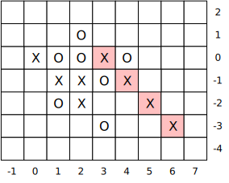
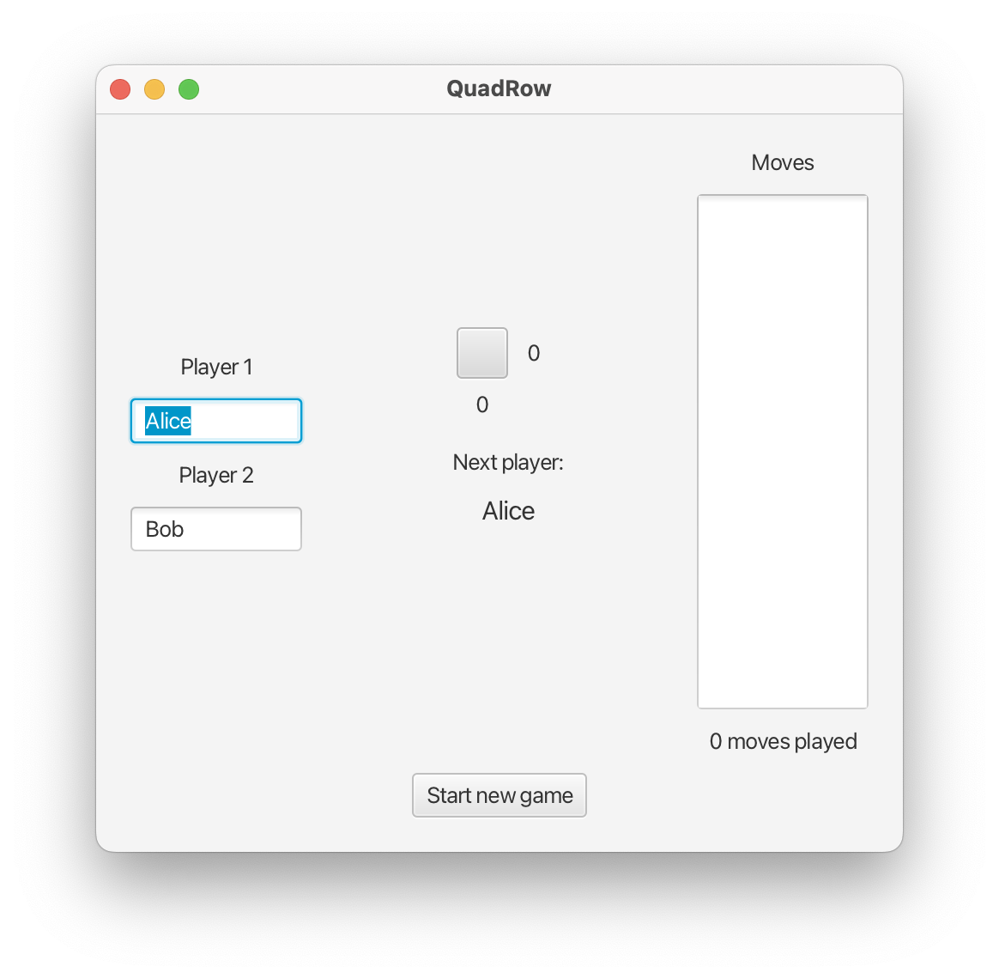
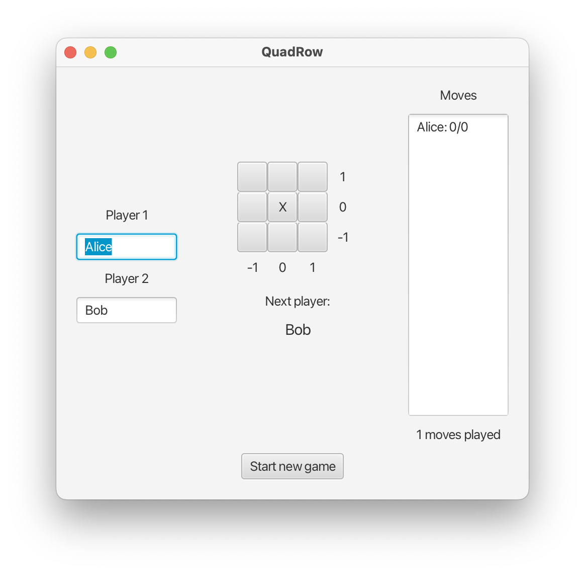
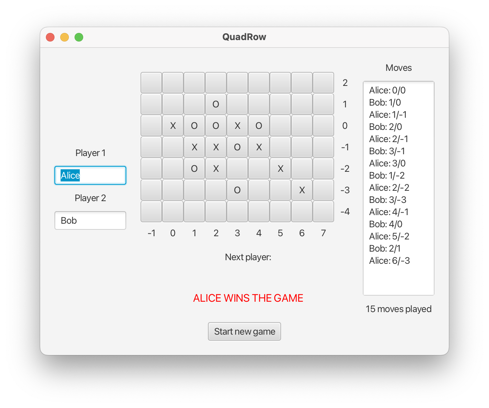

# Project & Training 1 (Block 3)

## Introduction

The goal of this Block 3 project is to develop a Java program to play the game **QuadStrike**. This game is similar to
the well-known Tic-Tac-Toe game, but it is played on an auto-resizeable board. To win the game, a row of *four*
crosses (or circles) is needed, either horizontally, vertically, or diagonally (in Tic-Tac-Toe, a row of three is needed
to win on a finite 3x3 board).

## Gameplay

Player 1 (Alice) marks crosses on the board and Player 2 (Bob) marks circles.

The game begins on a 1x1 board, and it is Alice's turn. She only has one option, namely to mark a cross at position 0/0.
Because the cross is at the edge of the board, it expands in all 4 directions to form a 3x3 board with x/y-coordinates
-1, 0 or 1.

It is now Bob's turn. He has 8 possibilities to mark a circle (all free cells around 0/0). Depending on where he places
the circle, the board expands to the left, top, right, or bottom, such that there is always a complete ring of free
cells around the already marked cells after each move. Let's assume that Bob chooses the position 1/0, then the board
expands to a 4x3 board.

It is now Alice's turn again. Assuming she chooses to mark her cross at position 1/-1, the board expands to a 4x4 board,
and if Bob then chooses 2/0, the board expands to 5x4 board. Note that Bob could not select -1/-2 in that situation,
because marking is only allowed in free cells adjacent to already marked cells.

The situation of the board after the first 4 moves is illustrated in the following figure, showing the board
expansion in each step.


Note that the board does not necessarily expand after every step in the game. If, for example, Alice marks her 3rd cross
at position 2/-1 (as indicated in the figure), the size of the 5x4 board remains unchanged.

The game ends when one of the two players gets a row of four in either direction. The next figure shows an example of a
winning situation for Alice on a 9x7 board, after a total of 15 moves (starting with the moves from the example above):

```
Alice: 0/0, 1/-1, 2/-1,  3/0, 2/-2, 4/-1, 5/-2, 6/-3
Bob  : 1/0,  2/0, 3/-1, 1/-2, 3/-3,  4/0,  2/1
```



## User Interfaces

Your implementation must consist of both a console app and an app with a graphical user interface (JavaFx). Below you
see some self-explanatory screenshots of how your solution could look like.

### Console App

```
WELCOME TO THE QUADSTRIKE APP
=============================

Enter name of Player 1: Alice
Enter name of Player 2: Bob

+–––+
|   | 0
+–––+
  0 

Alice > 0/0
+–––+–––+–––+
|   |   |   | 1
+–––+–––+–––+
|   | X |   | 0
+–––+–––+–––+
|   |   |   | -1
+–––+–––+–––+
 -1   0   1 

Bob > 1/0
+–––+–––+–––+–––+
|   |   |   |   | 1
+–––+–––+–––+–––+
|   | X | O |   | 0
+–––+–––+–––+–––+
|   |   |   |   | -1
+–––+–––+–––+–––+
 -1   0   1   2 

Alice > 1/-1
+–––+–––+–––+–––+
|   |   |   |   | 1
+–––+–––+–––+–––+
|   | X | O |   | 0
+–––+–––+–––+–––+
|   |   | X |   | -1
+–––+–––+–––+–––+
|   |   |   |   | -2
+–––+–––+–––+–––+
 -1   0   1   2 

Bob > 2/0
+–––+–––+–––+–––+–––+
|   |   |   |   |   | 1
+–––+–––+–––+–––+–––+
|   | X | O | O |   | 0
+–––+–––+–––+–––+–––+
|   |   | X |   |   | -1
+–––+–––+–––+–––+–––+
|   |   |   |   |   | -2
+–––+–––+–––+–––+–––+
 -1   0   1   2   3 

Alice > 2/-1
+–––+–––+–––+–––+–––+
|   |   |   |   |   | 1
+–––+–––+–––+–––+–––+
|   | X | O | O |   | 0
+–––+–––+–––+–––+–––+
|   |   | X | X |   | -1
+–––+–––+–––+–––+–––+
|   |   |   |   |   | -2
+–––+–––+–––+–––+–––+
 -1   0   1   2   3 

Bob > 3/-1
+–––+–––+–––+–––+–––+–––+
|   |   |   |   |   |   | 1
+–––+–––+–––+–––+–––+–––+
|   | X | O | O |   |   | 0
+–––+–––+–––+–––+–––+–––+
|   |   | X | X | O |   | -1
+–––+–––+–––+–––+–––+–––+
|   |   |   |   |   |   | -2
+–––+–––+–––+–––+–––+–––+
 -1   0   1   2   3   4 

Alice > 3/0
+–––+–––+–––+–––+–––+–––+
|   |   |   |   |   |   | 1
+–––+–––+–––+–––+–––+–––+
|   | X | O | O | X |   | 0
+–––+–––+–––+–––+–––+–––+
|   |   | X | X | O |   | -1
+–––+–––+–––+–––+–––+–––+
|   |   |   |   |   |   | -2
+–––+–––+–––+–––+–––+–––+
 -1   0   1   2   3   4 

Bob > 1/-2
+–––+–––+–––+–––+–––+–––+
|   |   |   |   |   |   | 1
+–––+–––+–––+–––+–––+–––+
|   | X | O | O | X |   | 0
+–––+–––+–––+–––+–––+–––+
|   |   | X | X | O |   | -1
+–––+–––+–––+–––+–––+–––+
|   |   | O |   |   |   | -2
+–––+–––+–––+–––+–––+–––+
|   |   |   |   |   |   | -3
+–––+–––+–––+–––+–––+–––+
 -1   0   1   2   3   4 

Alice > 2/-2
+–––+–––+–––+–––+–––+–––+
|   |   |   |   |   |   | 1
+–––+–––+–––+–––+–––+–––+
|   | X | O | O | X |   | 0
+–––+–––+–––+–––+–––+–––+
|   |   | X | X | O |   | -1
+–––+–––+–––+–––+–––+–––+
|   |   | O | X |   |   | -2
+–––+–––+–––+–––+–––+–––+
|   |   |   |   |   |   | -3
+–––+–––+–––+–––+–––+–––+
 -1   0   1   2   3   4 

Bob > 3/-3
+–––+–––+–––+–––+–––+–––+
|   |   |   |   |   |   | 1
+–––+–––+–––+–––+–––+–––+
|   | X | O | O | X |   | 0
+–––+–––+–––+–––+–––+–––+
|   |   | X | X | O |   | -1
+–––+–––+–––+–––+–––+–––+
|   |   | O | X |   |   | -2
+–––+–––+–––+–––+–––+–––+
|   |   |   |   | O |   | -3
+–––+–––+–––+–––+–––+–––+
|   |   |   |   |   |   | -4
+–––+–––+–––+–––+–––+–––+
 -1   0   1   2   3   4 

Alice > 4/-1
+–––+–––+–––+–––+–––+–––+–––+
|   |   |   |   |   |   |   | 1
+–––+–––+–––+–––+–––+–––+–––+
|   | X | O | O | X |   |   | 0
+–––+–––+–––+–––+–––+–––+–––+
|   |   | X | X | O | X |   | -1
+–––+–––+–––+–––+–––+–––+–––+
|   |   | O | X |   |   |   | -2
+–––+–––+–––+–––+–––+–––+–––+
|   |   |   |   | O |   |   | -3
+–––+–––+–––+–––+–––+–––+–––+
|   |   |   |   |   |   |   | -4
+–––+–––+–––+–––+–––+–––+–––+
 -1   0   1   2   3   4   5 

Bob > 4/0
+–––+–––+–––+–––+–––+–––+–––+
|   |   |   |   |   |   |   | 1
+–––+–––+–––+–––+–––+–––+–––+
|   | X | O | O | X | O |   | 0
+–––+–––+–––+–––+–––+–––+–––+
|   |   | X | X | O | X |   | -1
+–––+–––+–––+–––+–––+–––+–––+
|   |   | O | X |   |   |   | -2
+–––+–––+–––+–––+–––+–––+–––+
|   |   |   |   | O |   |   | -3
+–––+–––+–––+–––+–––+–––+–––+
|   |   |   |   |   |   |   | -4
+–––+–––+–––+–––+–––+–––+–––+
 -1   0   1   2   3   4   5 

Alice > 5/-2
+–––+–––+–––+–––+–––+–––+–––+–––+
|   |   |   |   |   |   |   |   | 1
+–––+–––+–––+–––+–––+–––+–––+–––+
|   | X | O | O | X | O |   |   | 0
+–––+–––+–––+–––+–––+–––+–––+–––+
|   |   | X | X | O | X |   |   | -1
+–––+–––+–––+–––+–––+–––+–––+–––+
|   |   | O | X |   |   | X |   | -2
+–––+–––+–––+–––+–––+–––+–––+–––+
|   |   |   |   | O |   |   |   | -3
+–––+–––+–––+–––+–––+–––+–––+–––+
|   |   |   |   |   |   |   |   | -4
+–––+–––+–––+–––+–––+–––+–––+–––+
 -1   0   1   2   3   4   5   6 

Bob > 2/1
+–––+–––+–––+–––+–––+–––+–––+–––+
|   |   |   |   |   |   |   |   | 2
+–––+–––+–––+–––+–––+–––+–––+–––+
|   |   |   | O |   |   |   |   | 1
+–––+–––+–––+–––+–––+–––+–––+–––+
|   | X | O | O | X | O |   |   | 0
+–––+–––+–––+–––+–––+–––+–––+–––+
|   |   | X | X | O | X |   |   | -1
+–––+–––+–––+–––+–––+–––+–––+–––+
|   |   | O | X |   |   | X |   | -2
+–––+–––+–––+–––+–––+–––+–––+–––+
|   |   |   |   | O |   |   |   | -3
+–––+–––+–––+–––+–––+–––+–––+–––+
|   |   |   |   |   |   |   |   | -4
+–––+–––+–––+–––+–––+–––+–––+–––+
 -1   0   1   2   3   4   5   6 

Alice > 6/-3
+–––+–––+–––+–––+–––+–––+–––+–––+–––+
|   |   |   |   |   |   |   |   |   | 2
+–––+–––+–––+–––+–––+–––+–––+–––+–––+
|   |   |   | O |   |   |   |   |   | 1
+–––+–––+–––+–––+–––+–––+–––+–––+–––+
|   | X | O | O | # | O |   |   |   | 0
+–––+–––+–––+–––+–––+–––+–––+–––+–––+
|   |   | X | X | O | # |   |   |   | -1
+–––+–––+–––+–––+–––+–––+–––+–––+–––+
|   |   | O | X |   |   | # |   |   | -2
+–––+–––+–––+–––+–––+–––+–––+–––+–––+
|   |   |   |   | O |   |   | # |   | -3
+–––+–––+–––+–––+–––+–––+–––+–––+–––+
|   |   |   |   |   |   |   |   |   | -4
+–––+–––+–––+–––+–––+–––+–––+–––+–––+
 -1   0   1   2   3   4   5   6   7 

GAME OVER: Alice wins after 15 moves: 0/0, 1/0, 1/-1, 2/0, 2/-1, 3/-1, 3/0, 1/-2, 2/-2, 3/-3, 4/-1, 4/0, 5/-2, 2/1, 6/-3

Start new game [y/n]? n
Bye!
```

**Note**: The console app must handle invalid user inputs, for example as follows:

```
WELCOME TO THE QUADSTRIKE APP
=============================

Enter name of Player 1: Alice
Enter name of Player 2: Bob

+–––+
|   | 0
+–––+
  0 

Alice > ksdhjgf
Invalid input, try again
Alice > 0
Invalid input, try again
Alice > 1/1
Invalid move, try again
Alice > 0/0
+–––+–––+–––+
|   |   |   | 1
+–––+–––+–––+
|   | X |   | 0
+–––+–––+–––+
|   |   |   | -1
+–––+–––+–––+
 -1   0   1 

Bob > 1/1
+–––+–––+–––+–––+
|   |   |   |   | 2
+–––+–––+–––+–––+
|   |   | O |   | 1
+–––+–––+–––+–––+
|   | X |   |   | 0
+–––+–––+–––+–––+
|   |   |   |   | -1
+–––+–––+–––+–––+
 -1   0   1   2 

Alice > 2/-1
Invalid move, try again
```

### JavaFx App

#### After 0 moves (new game):



#### After 1 move:



#### After 14 moves:


#### After 15 moves (game over:



## Tasks

Template classes with empty methods are given for the following classes:

- `Board`
- `Move`
- `Game`

All methods of these classes are already documented. You must implement these methods according to the documentation.
You also get two JUnit test classes `BoardTest` and `GameTest`. The goal for your implementation is to pass all tests
from both test classes.

You also get template classes `ConsoleApp` for the console app and `JavaFXApp` for the JavaFX application.

### Console App

- In the console app, moves are entered over the keyboard, as shown in the example above. Wrong inputs must be detected
  and handled.
- The name of the current player is shown at every step of the game.
- The textual representation of the board is obtained from the method `toString()`. It must be exactly as in the example
  shown above, otherwise corresponding tests will fail. This includes the x/y-coordinates shown at the bottom and the
  right side of the grid and the indication of a winning row of 4 crosses or circles (using the symbol `#`).
- At the end of the game, the winner is shown, together with total number of moves played and the list of all moves.
- It must be possible to restart a new game.

### JavaFX

- In the JavaFX app, moves are entered by clicking the cell to mark. Invalid moves must be detected and ignored.
- The application must always show the board in its current size, the name of the current player, the total number of
  moves played so far, and the list of all moves.
- If a one of the players wins the game, the 4 cells of the winning row must be highlighted and a "GameOver"-message
  must be shown.
- A button for starting a new game must be provided.

## Evaluation Criteria

These are the evaluation criteria:

* Correct implementation of the game logic (all provided test pass)
* A running console application that behaves exactly as the one in the example shown above.
* A running JavaFX application with the functionalities described above.

To pass this module, all three criteria above must be fulfilled to a satisfactory degree.

You must also submit clean code (no unused code, no TODOs, only a small number of warnings), apply the most common
naming conventions, and to declare variables and methods properly as private/public/protected.

## Importing the Project into Eclipse or IntelliJ

To import the project from the Git repository into Eclipse, select
<code>File -> Import... -> Git -> Projects from Git (with smart import) -> Clone URI</code>.
In IntelliJ, select <code>File -> New -> Project from version control -> Git -> clone</code>. In both cases, copy/paste
the repository URL from the GitLab web page.

The given repository contains a Maven project, which defines the necessary dependencies. By importing the project into
your IDE, the dependencies should be resolved automatically.

## Maven

To execute the console application <code>ch.bfh.bti3001.quadstrike.ConsoleApp</code> with Maven, type:

> `mvn clean compile exec:java`

To execute the JavaFX application <code>ch.bfh.bti3001.quadstrike.JavaFxApp</code> with Maven, type:

> `mvn clean compile javafx:run`
